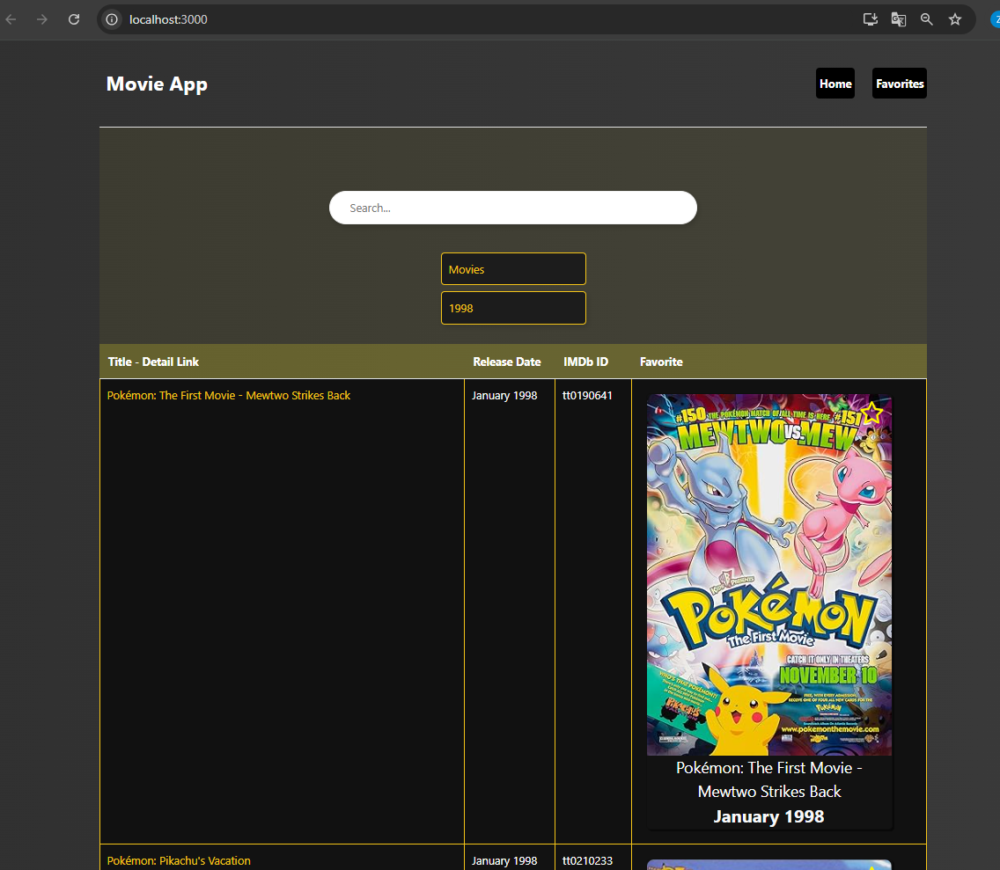
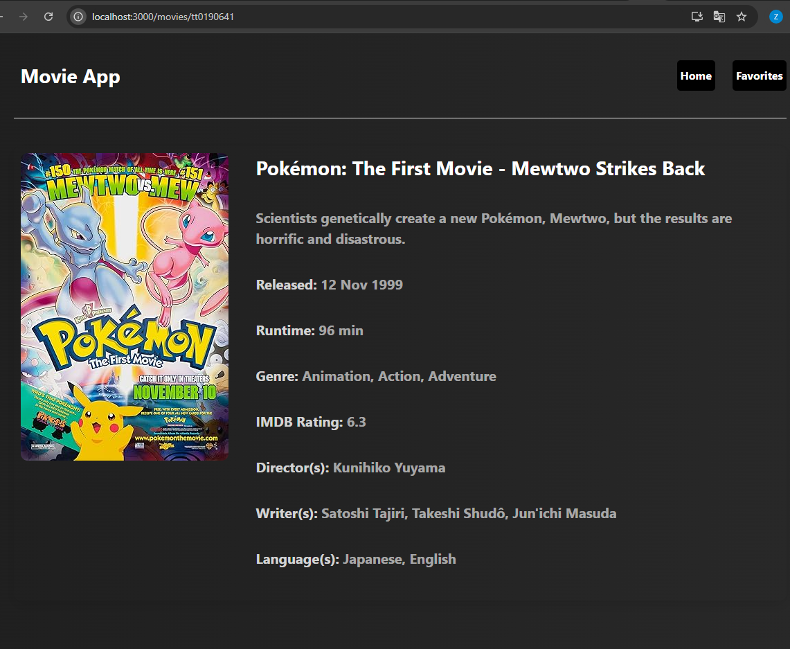

# Imdb Movie App

### Deployment
This project link: [https://imdbmovie-g1yk.vercel.app/](https://imdbmovie-g1yk.vercel.app/)

## Available Scripts

In the project directory, you can run:

# Project setup

### `npm install`

# Project start

### `npm run start`
Runs the app in the development mode.\
Open [http://localhost:3000](http://localhost:3000) to view it in your browser.

The page will reload when you make changes.\
You may also see any lint errors in the console.

# Home Page

  

# Detail Page

  

